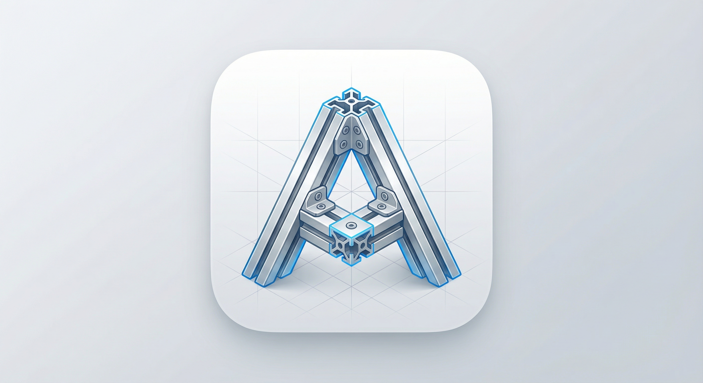
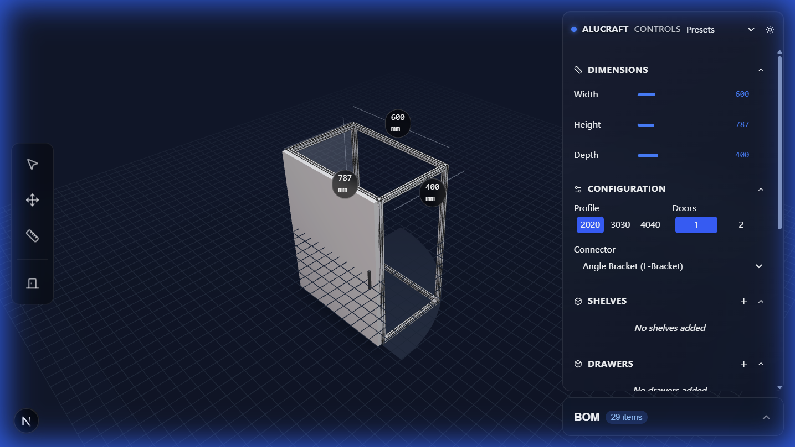

-----

# 🛠️ AluCraft




**AluCraft** 是一个基于 Web 的 3D 参数化设计工具，为铝型材DIY 爱好者开发。

## 项目定位 (Positioning)

AluCraft 是“面向全铝家居的 Figma”：一个 Web-first 的参数化设计工具，专注于把设计快速转换为可制造数据（BOM、切割清单、铰链逻辑）。

简短对比：
- 与 Figma：继承容器/布局模型与易用性，但聚焦家具/型材并集成制造导出；
- 与 Unity/Unreal：借鉴组件化的可扩展性，但不做游戏级物理或复杂交互；
- 与 SolidWorks/Blender：提供制造级数据输出与几何精度，但避免复杂约束求解器以保留 Web 性能与易用性；

核心目标受众：DIY 爱好者、橱柜工坊、小规模制造者与需要快速从设计过渡到采购/生产的用户。

更多架构与实现细节请查看：`docs/architecture.md`。


## ✨ 已实现功能 (Features)

目前项目处于早期开发阶段 (WIP)，已具备以下核心能力：

### 1\. 🧠 智能铰链计算引擎 (Hinge Logic Engine)

  * **自动推导：** 输入期望的“门板遮盖量 (Overlay)”，算法自动在 C80 (直/中/大弯) 和 盖25 系列中寻找最优解。
  * **参数校验：** 自动计算 K 值 (孔边距) 和螺丝调节量，防止超出五金件的物理调节范围。
  * **环境感知：** 勾选“靠墙”选项，系统会自动检测碰撞风险，并强制修正遮盖量（例如自动推荐大弯铰链以避让墙体）。


### 2\. 📐 参数化 3D 框架 (Parametric Frame)

  * **实时渲染：** 基于 React Three Fiber，实时生成 2020/3030/4040 等不同规格的铝型材模型。
  * **物理切割逻辑：** 实现了“立柱贯通、横梁让位”的自动切割算法，所见即所得。
  * **动态尺寸：** 拖动滑块调整长宽高，模型结构自动更新。

### 3\. 🔧 制造辅助 (Fabrication Aid)

  * **X-Ray 钻孔预览：** 在 3D 门板上可视化显示 35mm 铰链杯孔及螺丝孔的准确位置，随 K 值动态变化。
  * **交互模拟：** 点击“开门/关门”，直观检查门板开启轨迹是否会发生干涉（撞墙）。

## 🛠️ 技术栈 (Tech Stack)

  * **Framework:** [Next.js 14](https://nextjs.org/) (App Router)
  * **3D Engine:** [Three.js](https://threejs.org/)
  * **Renderer:** [React Three Fiber (R3F)](https://docs.pmnd.rs/react-three-fiber) & [Drei](https://github.com/pmndrs/drei)
  * **Animation:** React Spring
  * **Language:** TypeScript

## 🚀 快速开始 (Getting Started)

这是一个标准的 Next.js 项目。

```bash
# 1. 克隆项目
git clone https://github.com/tinnci/alucraft.git

# 2. 安装依赖
npm install

# 3. 启动开发服务器
npm run dev
```

打开浏览器访问 `http://localhost:3000` 即可开始设计。

## ⚠️ 免责声明 (Disclaimer)

本项目主要用于辅助 DIY 设计与验证思路。

  * 实际加工前，请务必根据您购买的实物五金参数进行二次核对。
  * 软件提供的切割尺寸未包含锯片损耗（通常为 3-5mm），下料时请预留余量。

-----

*Designed with ❤️.*
*AI generated, use with caution! *
